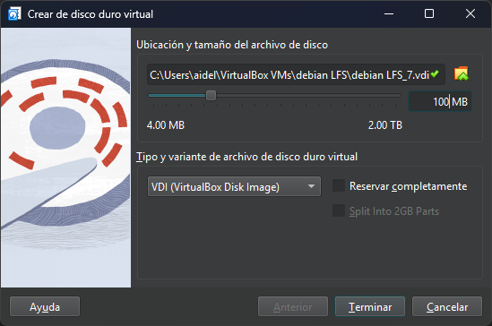
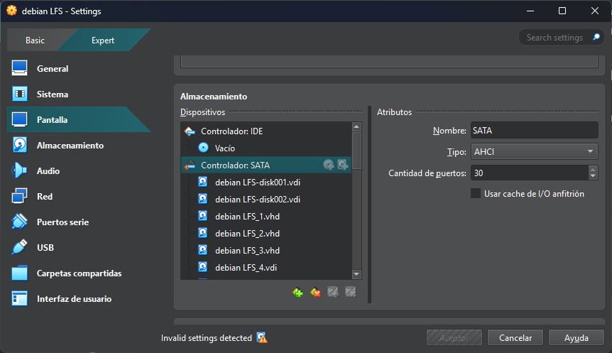

# Virutalbox - Máxima cantidad de recursos

Centro de Investigación en Computación
> _Tarea optativa 2_  
> _Alan Ignacio Delgado Alarcon_  
> _Semestre B24_

## Espacio experimental
* VirtualBox `7.1.4`
* Maquina Virtual `Debian 12 Bookworm`

## Discos duros
Se crearon discos duros virtuales en la configuración del virtualizador y se conectaron a la máquina virtual (MV).

Figura 1. Creación de unidad de almacenamiento

Del lado derecho de las configuraciones se observa en la parte `Atributos` que esta disponible un campo numerico donde es posible asignar hasta 30 puertos SATA para conectar unidades de almacenamiento.

Al asignar los discos se comprobo que el máximo número de unidades de almacenamiento que se pueden conectar a una MV es de 30. Una vez alcanzado este limite ya no es posible asignar más unidades a esa MV.

Figura 2. Límite de unidades de almacanamiento conectadas