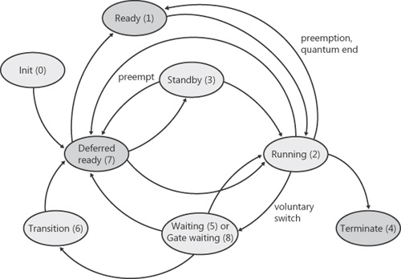
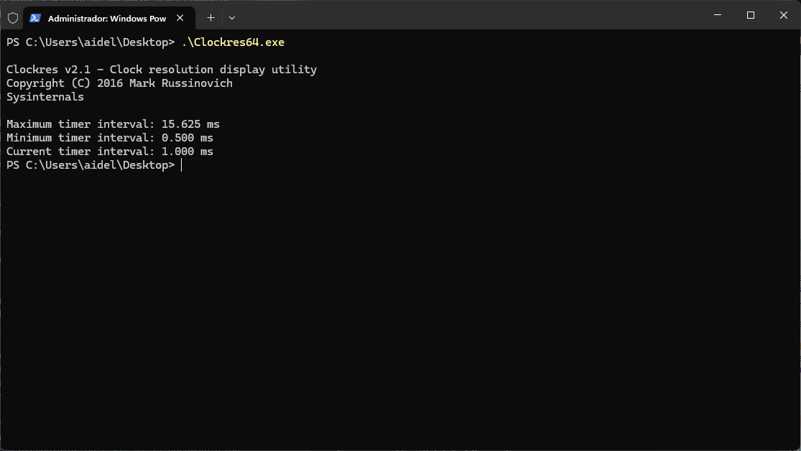

# :clock1:Valor del Quantum en Sistemas Operativos Windows

Centro de Investigación en Computación
> _Tarea optativa 1_  
> _Alan Ignacio Delgado Alarcon_  
> _Semestre B24_

## Introducción
Cuando un proceso es seleccionado para ejecutarse, se ejecuta durante un periodo de tiempo llamado _**quantum**_. Un quantum es el tiempo que se permite a un proceso ejecutarse antes de que otro proceso del mismo nivel de prioridad (o superior, lo que puede ocurrir en un sistema multiprocesador) tenga turno para ejecutarse en el _CPU_. Los valores de quantum pueden variar de un sistema a otro y de un proceso a otro por cualquiera de estas tres razones: 

1. Ajustes de configuración del sistema (quantums largos o cortos)
2. Estado en primer o segundo plano del proceso.
3. Uso del objeto _job_ para alterar el quantum. 

Sin embargo, un proceso puede no llegar a completar su quantum. En cuyo caso puede pasar a diferentes estados de acuerdo a como el planificador y sistema operativo definan estos, asi como sus prioridades.

  
Figura 1. Estados de Hilos y transiciones en Windows[^1]

## Sistema Operativo _Windows_
Debido a que Windows implementa un planificador preentivo, si otro subproceso con una **prioridad** más alta está listo para ejecutarse, el subproceso que se está ejecutando en ese momento podría ser adelantado antes de terminar su quantum de tiempo. De hecho, un proceso puede ser seleccionado para ejecutarse a continuación y ser adelantado incluso antes de comenzar su quantum.

Si un subproceso completa su quantum y no hay otros subprocesos con su misma prioridad, Windows permite que el subproceso se ejecute durante otro quantum. 

En Windows Vista, los subprocesos se ejecutan por defecto durante _**2 intervalos de reloj**_; en los sistemas Windows Server, por defecto, un subproceso se ejecuta durante _**12 intervalos de reloj**_. La razón de ser del valor por defecto más largo en los sistemas servidor es minimizar el _**cambio de contexto**_. Al tener un quantum más largo, las aplicaciones de servidor que se despiertan como resultado de una petición de un cliente tienen más posibilidades de completar la petición y volver a un estado de espera antes de que termine su quantum.

La longitud del intervalo de reloj varía en función de la plataforma de hardware. La frecuencia de las interrupciones del reloj depende de la HAL, no del núcleo. Por ejemplo, el intervalo de reloj para la mayoría de los uniprocesadores x86 es de unos **10 milisegundos**, y para la mayoría de los multiprocesadores x86 y x64 es de unos **15 milisegundos**. Este intervalo de reloj se almacena en la variable del núcleo `KeMaximumIncrement` como cientos de nanosegundos.

### Cálculo del valor _quantum_
Debido a los cambios en la contabilidad del tiempo de ejecución de los hilos en Windows Vista, el sistema no utiliza el recuento de ciclos de reloj como factor decisivo para saber cuánto tiempo ha ejecutado un hilo y si su quantum ha expirado. En su lugar, cuando el sistema arranca, se realiza un cálculo cuyo resultado es el número de ciclos de reloj al que equivale cada _quantum_ (este valor se almacena en la variable del núcleo `KiCyclesPerClockQuantum`).

> [!NOTE]  
> Este cálculo se realiza multiplicando la velocidad del procesador en Hz (ciclos de reloj de la CPU por segundo) por el número de segundos que tarda en dispararse un tic de reloj (basándose en el valor `KeMaximumIncrement` descrito anteriormente).

A partir de Windows Vista, los hilos no se ejecutan durante un número _quantum_ basado en ciclos de reloj; en su lugar, se ejecutan durante un objetivo _quantum_, que representa una estimación de cuál debería ser el número de ciclos de reloj de CPU que el hilo ha consumido cuando su turno sería cedido. 

Este objetivo debería ser igual a un número equivalente de ticks del temporizador de intervalo de reloj porque, como acabamos de ver, el cálculo de ciclos de reloj por cuanto se basa en la frecuencia del temporizador de intervalo de reloj, que puedes comprobar utilizando el siguiente experimento. Por otro lado, como los ciclos de interrupción no se cargan al hilo, el tiempo de reloj real puede ser mayor.

### Visibilidad del valor _quantum_
Desde Windows Vista, Microsoft modifico sus politicas de visibilidad de variables y manejo de recursos para corregir error de seguridad en el manejo de variables con direcciones fisicas en la mamoria RAM, por lo que a partir de esta versión no es posible ver el valor en tiempo real o consultarlo directamente desde el sistema en ejecución.

#### Experimentos para visualizar el _quantum_
##### 1. Determinación de la frecuencia del intervalo del reloj
La función de Windows `GetSystemTimeAdjustment` devuelve el intervalo de reloj. Para determinar el intervalo de reloj en el sistema se debe descargar y ejecutar el programa `Clockres` de _Windows Sysinternals_ disponible en[^2]. Aquí está la salida de un sistema **Windows 11 Pro de 64 bits**:

  
Figura 2. Salida en Windows 11 Pro 64 bits.

##### 2. Determinación de los ciclos de reloj por _quantum_
Windows no expone el número de ciclos de reloj por quantum a través de ninguna función, pero con el cálculo y la descripción previamente discutida, debería permitir determinarlo usando un depurador del kernel como `WinDbg` en modo _depuración local_.

Este experimento necesita de un laboratorio con la herramienta para poder ser replicado. Debido a limitacciones técnicas en recursos este experimento no se ejecuto, pero se documenta como parte de la obtenmción del valor de _quantum_.

La descripción para crear el laboratorio, ejecutar los experimentos y una guia basica de funcionamiento de la herramineta `` estan disponibles en [^3][^4] la documentación oficial de Microsoft.

## Conclusiones
Debido a que Windows es un software propietario y a sus politicas, no es posible observar el valor real del quantum que esta configurado en el sistema, y los experimentos donde puede observarse estan sujetos a los diferentes escenarios donde se ejecuten.
Todos estos experimentos e información fueron consultados en[^1] 

## Referencias
Las referencias de consulta utilizadas se encuentran a pie de página de este formato.

[^1]:  https://www.microsoftpressstore.com/articles/article.aspx?p=2233328&seqNum=7 
[^2]:  https://live.sysinternals.com/tools/
[^3]:  https://learn.microsoft.com/es-es/windows-hardware/drivers/debugger/debug-universal-drivers---step-by-step-lab--echo-kernel-mode-
[^4]: https://learn.microsoft.com/es-es/windows-hardware/drivers/debugger/getting-started-with-windbg--kernel-mode-